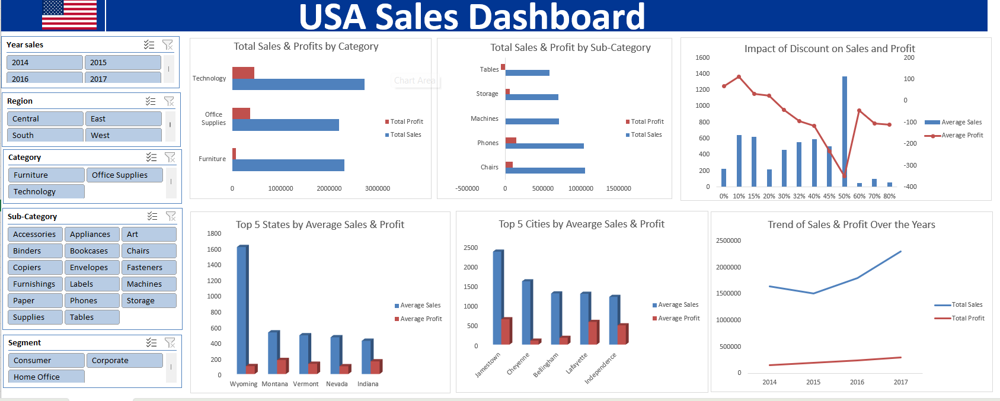

# Data Analytics Portfolio 

# Project 1
**Title:** [USA Sales Dashboard](https://github.com/meshmeso/Meshmeso.github.io/blob/main/USA%20sales%20dashboard.xlsx)

**Tools Used:** Microsoft Excel (Pivot Table, Pivot Chart, Power query editor, conditional formatting, Slicers, Data Cleaning, Sorting and Filtering, Calculated Metrics/KPIs, Dashboard Design & Visualisation).

**Project Description:** The aim of this dashboard was to analyse USA sales performance and generate actionable business insights by examining product performance, profitability, regional sales trends, customer behavior, and the impact of discounts on revenue and profit. The dashboard was designed to support data-driven decision-making through interactive visualizations and filters.

**Key Findings:** Technology is the best-performing category in both sales and profit.
Phones are the top-performing sub-category, generating the highest revenue and strong profitability.
Some products, such as Tables and Bookcases, generate high sales but low or negative profit, indicating possible pricing or discount issues.
Higher discount levels generally reduce profit margins, even when they increase sales.
Sales and profit steadily increased from 2014 to 2017, showing overall business growth.
Wyoming and Jamestown recorded some of the highest average sales and profits among states and cities analyzed.
Interactive slicers allow users to filter the dashboard by year, region, category, sub-category, and customer segment for deeper analysis.

**Dashboard Overview:**

